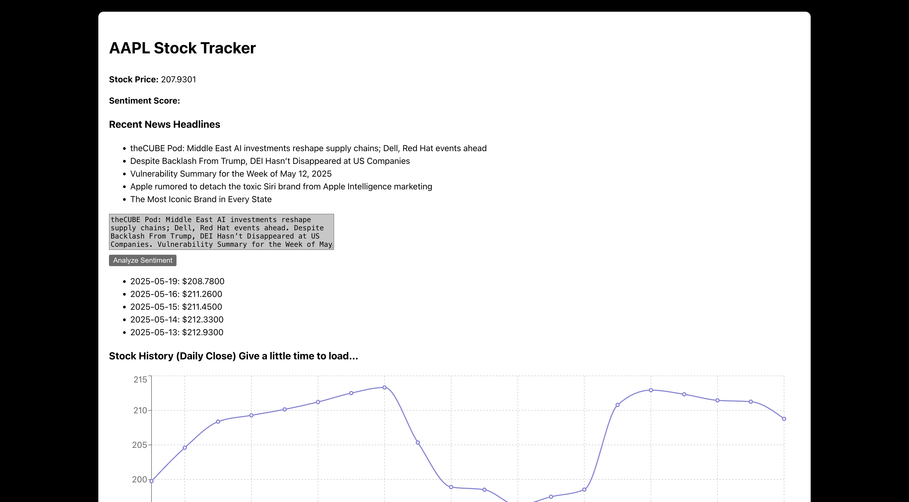

# 📈 Stock Sentiment & Forecasting App

An interactive web app that analyzes stock performance by combining **real-time market data**, **news sentiment analysis**, and **financial engineering models** such as ARIMA and GARCH. Users can view stock trends, predict short-term returns, and explore volatility modeling through powerful statistical tools.

The code is set to AAPL but it can be modified for other stock tickers.

---

## 🚀 Features

- 🔍 Live stock data via Alpha Vantage & Yahoo Finance
- 🧠 Sentiment analysis of recent news headlines using NLP
- 📈 Predictive modeling with ARIMA and GARCH
- 📊 Interactive data visualization (daily close charts, forecasts)
- 🧪 Linear regression between sentiment and return movement

---

## 🛠️ Tech Stack

- **Frontend**: React.js, Recharts
- **Backend**: Flask (Python)
- **APIs**: Alpha Vantage, Yahoo Finance, NewsAPI
- **ML/Stats**: `scikit-learn`, `statsmodels`, `arch`, `pandas`, `numpy`

---

